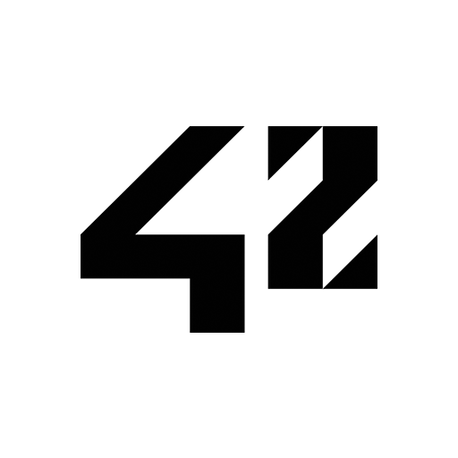

### Hi there 👋
* 👂 My name is Jokin
* 👩 Pronouns: He/Him
* 💬 Ask me about my favourite Magic the Gathering Cards
* 📫 How to reach me: jokin.dev@gmail.com
* ❤️ I love cats
* ⚡ Fun fact: pillbugs can extract heavy metal from soil

 

<!--
**Alfombruh/Alfombruh** is a ✨ _special_ ✨ repository because its `README.md` (this file) appears on your GitHub profile.

Here are some ideas to get you started:

- 🔭 I’m currently working on ...
- 🌱 I’m currently learning ...
- 👯 I’m looking to collaborate on ...
- 🤔 I’m looking for help with ...
- 💬 Ask me about ...
- 📫 How to reach me: ...
- 😄 Pronouns: ...
- ⚡ Fun fact: ...
-->
